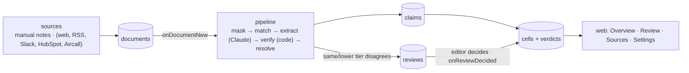

# Nofence competitor analytics

Internal tool that keeps a live, evidence-first comparison of Nofence against its virtual-fencing competitors.
Every value in the tables traces back to a dated, sourced, verbatim quote; inferences are labelled; gaps stay
gaps. Sources arrive continuously (notes today; websites, news, Slack, HubSpot and Aircall in later phases) and are
turned into **claims**, which the tool resolves into the current **cells** of the comparison by trust tier, recency
and human review.

Live at https://nofence-competitor-compare.web.app (Nofence Google accounts only).
Design and decisions: [docs/v2-architecture.md](docs/v2-architecture.md). Mockups: the "Competitor Comparison Table"
Claude Design canvas.

## How it works



- **Stated** cells carry a quote that code confirms is a substring of the masked source; a stated price or number
  must appear inside the quote or it is downgraded. Nothing is invented.
- **Trust tiers** 1 Official → 5 Opinion. A higher tier auto-replaces a lower one; equal or lower opens a review.
- **Markets** are the six countries Nofence sells in (US, UK, IE, NO, SE, ES); the UI groups UK/IE and NO/SE.
- **Freshness** is per field (30 / 90 / 180 / 365 days / never) from *last checked*, not from capture.
- **Masking** replaces customer names, emails and phone numbers before anything is stored or sent to the model.
- **Crawler**: competitor pages become tier-1 sources when their text changes; an unchanged page only refreshes
  *last checked*. A newer snapshot of a page supersedes what that page said before.

## Repository

```
shared/      Zod schemas for every Firestore collection, ids, freshness rules       (node:test)
functions/   Cloud Functions for Firebase (TypeScript, esbuild bundle, node 22)      (node:test)
  src/pipeline   mask · match · extract · verify · resolve · verdict · review · run
  src/seed       registry (markets, fields, competitors) and the Sep-2026 sample notes
web/         Next.js static export on Firebase Hosting; Firestore via the web SDK
docs/        architecture plan
firestore.rules · storage.rules · firebase.json
```

Firebase project `nofence-competitor-compare`, region europe-west1, Storage in the EU multi-region.

## Develop

```bash
npm install                     # all workspaces
npm test                        # shared + functions unit tests
npm run typecheck
npm run dev:web                 # http://localhost:3000 against the live project (sign in with a nofence.com account)
```

Deploy (needs `firebase login` and the `ANTHROPIC_API_KEY` secret already set in the project):

```bash
firebase deploy --only functions,hosting,firestore:rules,storage
```

Runtime parameters live in `functions/.env` (`CLAUDE_MODEL`, `ADMIN_EMAILS`); the Anthropic key is a Secret Manager
secret (`firebase functions:secrets:set ANTHROPIC_API_KEY`). The Firestore emulator needs a Java runtime, which the
current dev Mac does not have; the pipeline's Firestore glue is exercised against the real project via
Settings → Re-run all sources.

## Roles

Sign-in is Google, restricted to `@nofence.com` and `@nofence.no`. First sign-in creates a **viewer**; emails in `ADMIN_EMAILS` are
promoted to **admin** automatically. Admins set roles under Settings → People. Editors add notes, decide reviews and
confirm or outdate cells; admins also manage fields, decay, competitors and re-runs.

## Status

Live: registry, pipeline, Overview with market switcher and evidence popover, Sources register with manual notes,
Review inbox, Battlecards (generated from cells, flagged when inputs change), website + RSS crawler (daily 06:00
Oslo, on demand from Settings), competitor editor. Next: Slack / HubSpot / Aircall with masking (phase 4),
Marketing, Ask and the weekly digest (phase 5).
