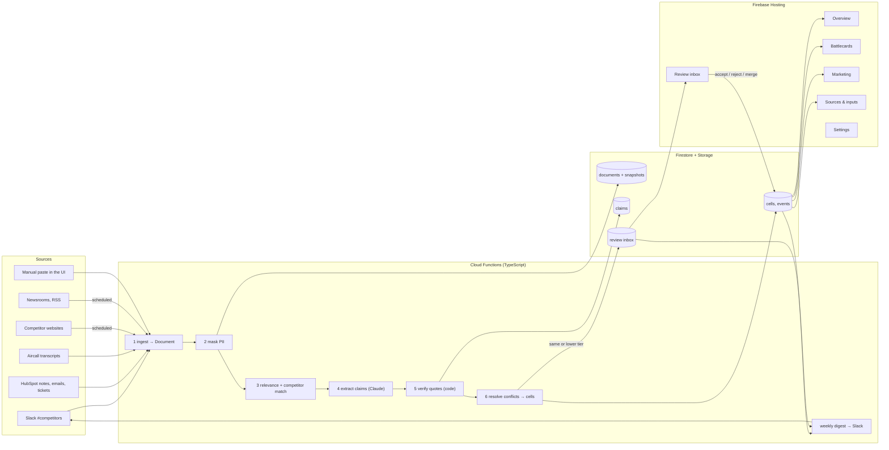

# Competitor Comparison v2 — architecture plan

Status: draft for review, 23 Sep 2026. Nothing here is built yet.

v1 turned a hand-pasted blob of notes into a verified comparison table. v2 keeps the part that made v1 trustworthy
(every stated value carries a verbatim quote that code, not the model, verifies) and replaces the pasting with
continuous ingestion from Slack, HubSpot, Aircall, competitor websites and news feeds.

## 1. What changes, in one paragraph

In v1 a comparison was the *output of one run*. In v2 the core object is a **claim**: one dated, sourced, masked
statement about one competitor, one field, and optionally one market ("Halter US lease: $90/head/yr, from
halter.com/pricing, seen 14 Sep 2026"). Claims accumulate. The comparison table is a **view** that picks the current
best claim per cell using trust tier, recency and human review. The six-step pipeline survives almost unchanged, but
it runs once per incoming document instead of once per comparison, and it gains two steps: masking before extraction
and conflict resolution after verification.

## 2. Platform

Everything runs in the Google project `nofence-competitor-compare`, region `europe-west1` (Belgium). Google's data
processing terms already cover Nofence, so no new vendor touches customer data. The only external processor is the
Anthropic API, which sees masked text only.

| Piece | Service | Why |
|---|---|---|
| Frontend | Firebase Hosting, static Next.js export | Simple URL (`nofence-competitor-compare.web.app`, later `compare.nofence.com`), CDN, no server to run |
| Sign-in | Firebase Auth, Google provider, `hd=nofence.com` enforced in rules | Employees use their existing Google account |
| Data | Firestore | Document model fits claims/cells/events; browser reads it directly under security rules |
| Raw snapshots | Cloud Storage | Masked page text and transcript excerpts, so quotes stay verifiable years later |
| Ingestion, extraction, digests | Cloud Functions for Firebase, 2nd gen, TypeScript | Scheduled and webhook-triggered; 60 min max runtime handles crawls |
| Model | Claude API (Sonnet for extraction, Opus for judging/battlecards) | Replaces v1's headless `claude -p` which cannot run as a service |
| Secrets | Secret Manager via `defineSecret` | Slack, HubSpot, Aircall, Anthropic keys never in code or Firestore |

Netlify and Jev/TypeSafe are dropped. The Python backend is retired once the TypeScript functions reach parity
(section 9).

Estimated running cost: Firebase a few dollars a month at this scale; Claude API roughly $20 to $60 a month depending
on transcript volume. The weekly web crawl and Slack channel are negligible.

## 3. System overview



The browser talks to Firestore directly for reads and simple writes (notes, reviews, settings), guarded by security
rules. Functions do everything that needs secrets or the model.

## 4. Data model (Firestore)

Names are collections; fields marked `*` are indexed for the main queries.

**competitors** — the registry
- `id`, `name`, `aliases[]`, `website`, `crawlPages[]` (url, market, label), `feeds[]` (RSS urls), `markets[]`
- `status*`: `active | draft | archived`. New names detected in sources are created as `draft` with whatever the crawler
  finds on their website; an admin promotes them. Nofence itself is a competitor row with `isSelf: true`.

**fields** — the schema (v1 FieldDefinition plus decay)
- `id`, `label`, `type`, `comparisonRule`, `unit`, `description`, `allowedValues[]`, `perMarket: bool`
- `decayDays: 30 | 90 | 180 | 365 | null` (null = never stale). Editable in Settings only.
- `group`: `overview | features | pricing | context` (which Overview section it renders in), `order`

**markets** — `US, UK_IE, NO_SE, ES` plus `GLOBAL`. Small, admin-editable.

**documents** — one per ingested thing (a Slack message or thread, a HubSpot note, a call transcript, one crawled
page at one point in time, one RSS item, one manual paste)
- `connector*`: `slack | hubspot | aircall | web | rss | manual`
- `externalId`, `externalUrl`, `title`, `author` (masked to role for customers, kept for employees)
- `capturedAt*`, `publishedAt` (for web/RSS the page's own date if found)
- `competitorIds[]*` (after matching), `relevance: 0..1`, `status*`: `new | processed | ignored | failed`
- `snapshotPath` → Cloud Storage object holding the **masked** text. Raw text is never stored.
- `contentHash` — for web pages, unchanged hash means "checked, not changed" (see freshness)

**claims** — the atomic unit
- `competitorId*`, `fieldId*`, `marketId*` (or `GLOBAL`), `documentId`
- `value` (typed as in v1), `displayValue`, `status`: `stated | inferred`
- `quote`, `startChar`, `endChar`, `verified: bool` — quote is a substring of the masked snapshot
- `tier*`: 1..5 (section 5), `confidence`
- `firstSeenAt`, `lastChangedAt`, `lastCheckedAt` (section 6)
- `supersededBy` (claim id) when a higher-tier or accepted claim replaced it. Nothing is deleted.

**cells** — the materialised current answer per (competitor, field, market); what the tables render
- `competitorId*`, `fieldId*`, `marketId*`
- `claimId` (the winning claim), `value`, `displayValue`, `status`: `stated | inferred | missing`
- `tier`, `corroboration: { count, agreeing, conflicting }`, `freshness` (computed, section 6)
- `conflict: bool` — an unresolved lower-or-equal-tier claim disagrees
- `confirmedBy`, `confirmedAt` — a human clicked "Confirm still valid"
- `publishable: bool` — derived: tier ≤ 2, not stale, not conflicting (Marketing tab reads this)

**verdicts** — per (competitorId, fieldId, marketId): `win | lose | tie | n/a`, `rationale`, `method: rule | llm`.
Recomputed whenever either side's cell changes. Same rules as v1.

**events** — the timeline ("Recent moves to watch")
- `competitorId*`, `kind`: `funding | launch | market_entry | pricing_change | partnership | leadership | other`
- `headline`, `summary`, `occurredAt*`, `documentId`, `tier`, `marketIds[]`, `verified`

**reviews** — the inbox
- `kind`: `conflict | new_competitor | low_confidence | stale_pricing`
- `cellId` or `competitorId`, `claimIds[]`, `status*`: `open | accepted | rejected | merged`, `decidedBy`, `decidedAt`

**battlecards**, **snippets** — generated content per competitor and market, with `generatedFromCellIds[]` and
`generatedAt`, so a card can be flagged when its inputs change.

**users** — `email`, `role: viewer | editor | admin`, created on first sign-in as `viewer`. **settings** — one document
for digest schedule, Slack channel to post to, crawl frequency.

## 5. Trust tiers and conflict rules

| Tier | Name | Examples | Auto-wins over |
|---|---|---|---|
| 1 | Official | Competitor's own website, price list, press release, filings | 2–5 |
| 2 | Third-party public | Trade press, news, conference talks, research reports | 3–5 |
| 3 | Firsthand internal | Support ticket from a switcher, transcript where the *farmer* states a fact, a document a customer forwarded | 4–5 |
| 4 | Hearsay | Rep recalls what a farmer said, Slack "I heard that…" | 5 |
| 5 | Opinion | Our own assessment, "their app seems weaker" | nothing |

Connector sets a default tier (web/RSS → 1 or 2 by domain list, HubSpot/Aircall → 3, Slack/manual → 4). Extraction
can lower it (a Slack message quoting a press release stays 4 unless the URL is included, in which case the URL gets
crawled and becomes its own tier 1 or 2 document).

Conflict rule when a new verified claim disagrees with the current cell:
1. New claim has a **strictly higher** tier (lower number) → it wins automatically. Old claim gets `supersededBy`,
   cell updates, an entry is written to the cell's history. No review needed.
2. **Same or lower** tier → cell keeps its value, `conflict: true`, a `review` opens. The weekly digest lists it.
3. Reviewer accepts (new claim wins), rejects (new claim marked `rejected`, stays in history), or merges (edits the
   value by hand; the cell becomes `status: stated` with `tier` of the best supporting claim and `confirmedBy` set).

Equal-value claims from a different document **corroborate**: `corroboration.count` and `agreeing` increase, and if
either is tier 1–2 the cell becomes `publishable`.

## 6. Freshness

Three timestamps per claim and cell:
- `firstSeenAt` — when we first saw this value
- `lastChangedAt` — when the value last changed (a re-crawl with identical hash does not move this)
- `lastCheckedAt` — when we last confirmed the source still says this (re-crawl, or a human "Confirm still valid")

Freshness level is computed from `lastCheckedAt` against the field's `decayDays`:
- **fresh**: under half of decay
- **aging**: between half and full decay
- **stale**: past decay, or a human marked it outdated

A founding year with `decayDays: null` never goes stale. Pricing at 90 days does. Stale pricing cells drop out of
Marketing (`publishable: false`) until confirmed, matching the mockup's rule. Decay per field is set in Settings →
Fields, deliberately away from the main screens.

The Sources & inputs register shows per document: connector, competitor(s), tier, captured, last checked, and
freshness; per cell the popover shows the same three dates plus corroboration ("2 sources agree, 1 disagrees").

## 7. Ingestion pipeline, per connector

Every connector produces `documents`; from step 2 on, the pipeline is shared.

| Connector | Trigger | Scope | Notes |
|---|---|---|---|
| Slack | Events API webhook (`message.channels`) on named channels only | `#competitors` (configurable list) | Thread replies attached to the parent document. Employee names kept (they're the author), customer names masked. |
| HubSpot | Scheduled every 6 h, `updatedAfter` cursor | Notes, logged emails, call notes, tickets whose body matches any competitor alias | Uses the search API with a keyword filter to avoid pulling everything. |
| Aircall | `transcription.created` webhook | All calls with a transcript | Cheap relevance check first (alias match in transcript); non-matching calls are dropped without storing anything. Requires AI Assist plan. |
| Web | Scheduled weekly (configurable) per `crawlPages` entry | Product, pricing, news pages per competitor and market | Fetch with a market-appropriate `Accept-Language`; HTML → readable text; hash compared to last snapshot. Unchanged → only `lastCheckedAt` moves, no extraction. |
| RSS / newsrooms | Scheduled daily | `feeds[]` per competitor plus a shared trade-media list | New items only. Items mainly produce **events**, sometimes claims. |
| Manual | UI form | Anyone signed in | Textarea per competitor, author and date auto-tagged, tier chosen by the user (default 4). |

Shared steps:

2. **Mask** — before storage. Deterministic pseudonymisation: person names → `Customer A/B/…` (employees on the Nofence
   side are kept), phone numbers, emails, postal addresses and farm names → typed placeholders. Same approach as the
   other Nofence project; reuse its implementation if it's a library, otherwise a small NER + regex pass. Competitor
   names, product names, prices and locations at country/region level are kept. The masked text is the stored
   snapshot and the only text the model ever sees.
3. **Relevance and matching** — alias match against `competitors` (including drafts). Unknown company names that
   co-occur with virtual-fencing vocabulary create a `draft` competitor and a `new_competitor` review. Documents
   with no match are marked `ignored` and their snapshot deleted after 7 days.
4. **Extract** — Claude with a JSON schema, one call per (document, competitor). Prompt includes the field list with
   extraction guidance, the markets list, and the tier rules. Output: claims and events with quotes and char offsets.
   Per-market values are extracted when the text names a market or currency; otherwise `GLOBAL`.
5. **Verify** — port of v1 `pipeline.verify`: quote must be a substring of the snapshot; specific numbers must appear
   inside the quote; downgrade, never invent. Adds: currency must match the claimed market, or the market is dropped
   to `GLOBAL` with a note.
6. **Resolve** — section 5 rules; write cells, corroboration, verdicts, reviews.

**Weekly digest** — Monday morning function posts to a Slack channel: new claims accepted, open conflicts, stale
pricing cells, draft competitors awaiting promotion, with links into the tool. Named admins are mentioned.

## 8. Frontend

The four-tab mockup is the target: Overview, Battlecards, Marketing, Sources & inputs. Added: a **Review** tab
(badge with open count), an **Ask** box (below), and a **Settings** area (competitors, fields and decay, markets, connectors, users) reachable
from a gear icon, not the tab bar. "Full details" from v1 becomes a "show evidence table" toggle on Overview rather
than a fifth tab.

Market switcher on every tab filters cells to that market plus `GLOBAL`. Every cell opens "Where does this come
from?" with the winning claim, the three dates, corroboration, other claims (agreeing and conflicting), and the
actions Confirm still valid / Mark outdated / Edit.

**Ask** (added 23 Sep after review): a question box available on every tab. "Is there any mention of Halter coming up
with new models?" runs as a function: it selects the relevant competitor(s) and fields from the question, pulls the
matching claims, events and masked document snippets from Firestore, and asks Claude to answer **only from that
material**, citing each statement with the cell or document it came from. Answers link back into the tool (open the
cell, open the source). When the sources don't cover it, the answer says so instead of guessing. Questions and answers
are stored per user so the inbox reviewers can see what people are asking and where the data has gaps.

Battlecards and Marketing snippets are generated by a function from cells only (as in v1's grounding rule), cached,
and flagged "inputs changed" when any source cell updated after `generatedAt`. Marketing shows only `publishable`
cells and lists the rest under "Don't use in marketing" with the reason.

Tech: keep Next.js and the ported Industry design system from v1, but as a static export (`output: "export"`) served
by Firebase Hosting; data via the Firebase web SDK with real-time listeners so the inbox and tables update live.

## 9. Repository layout and migration

```
/web            Next.js app (static export)         ← evolves from /frontend
/functions      Cloud Functions, TypeScript          ← replaces /backend (Python)
/shared         Zod schemas + TS types for all collections, shared by web and functions
/firestore.rules, /storage.rules, /firebase.json, /.firebaserc
/docs           this plan, connector setup notes
/fixtures       masked sample documents for tests    ← evolves from /fixtures
```

Phases, each ending in something you can click:

1. **Foundation** — Firebase init, Auth with domain restriction, Firestore rules, `shared` schemas, seed fields from
   v1 presets + the doc's agtech field set, seed Nofence/Monil/Halter from the doc's competitor details as **manual
   tier-4 documents** run through the real pipeline. Result: Overview tab showing today's data with popovers.
2. **Pipeline port** — extract, verify, resolve, verdicts as functions; manual paste connector; review inbox UI.
   Python backend deleted. Result: paste notes, see conflicts appear and resolve them.
3. **Web + RSS connectors** — crawl config in Settings, weekly schedule, hash-based freshness, events. Result:
   competitor pricing pages tracked automatically.
4. **Internal connectors** — masking module, Slack channel webhook, HubSpot poller, Aircall webhook. Result: the tool
   fills itself.
5. **Battlecards, Marketing, Ask, digest, custom domain.** Result: what the mockup shows, plus a question box and
   Monday Slack posts.

Phase 1 and 2 can be reviewed on a preview channel before anything is announced internally.

## 10. Open points

- **Masking implementation**: is the other project's masking a reusable library or service? Decides whether phase 4
  reuses or rebuilds it.
- **Anthropic API coverage**: confirm a data-processing agreement exists (Claude for Work / API terms). Only masked
  text is sent, but it should be on record.
- **Aircall plan**: confirm AI Assist is enabled (you're admin, so a quick check).
- **Slack channel list**: which channel(s) exactly, and who tells the team the channel is read by the tool.
- **HubSpot scope**: notes and logged emails only, or also tickets? Plan assumes all three, keyword-filtered.
- **Custom domain**: `compare.nofence.com` needs one DNS record from whoever manages the domain.
- **Firestore region**: plan says `europe-west1`; it cannot be changed after creation, so confirm before phase 1.
